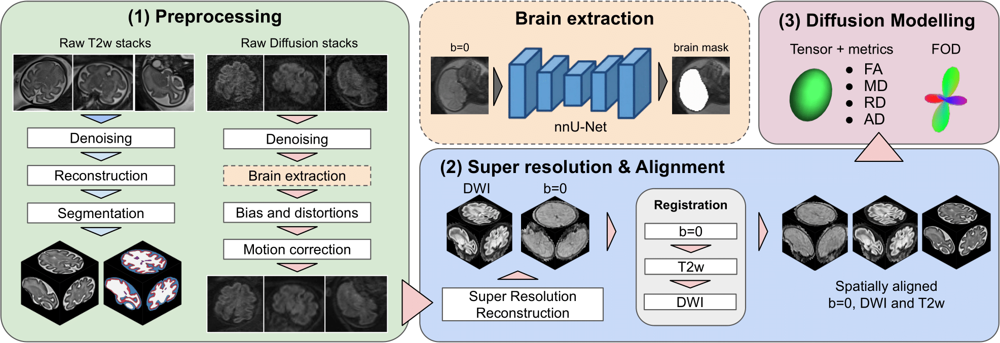

# Open-Source Pipeline for Super-Resolution of Fetal NHP Diffusion MRI

> **_NOTE:_**  Currently under development.

This framework reconstructs high-resolution, motion-corrected 3D diffusion volumes from multiple low-resolution, motion-corrupted 2D stacks of fetal non-human primate (NHP) MRI data. It integrates state-of-the-art tools for distortion correction, motion correction, slice-to-volume reconstruction (SVR), and higher-order diffusion modeling to produce high-quality data suitable for advanced analysis, such as Fiber Orientation Distribution (FOD) for tractography.

<p align="center">
  
</p>

## Pipeline Overview

The pipeline is organized into three main stages:

1.  **Preprocessing:** Each individual 2D diffusion stack is independently processed. This includes denoising, Gibbs ringing correction, brain extraction, bias field correction, and comprehensive correction for eddy currents, subject motion, and susceptibility-induced distortions using FSL `eddy` with either TOPUP- or T2-based field map estimation.

2.  **Super-Resolution & Alignment:**
    *   All preprocessed stacks are rigidly registered to a common reference stack.
    *   Slice-to-Volume Reconstruction (SVR) is used to generate a single high-resolution, motion-corrected `b=0` volume.
    *   The SVR volume is aligned to a high-resolution T2-weighted anatomical template.
    *   Finally, the full diffusion-weighted signal is reconstructed into the T2 template space at high resolution using an iterative method that models the signal with Spherical Harmonics.

3.  **Diffusion Modelling:** The final high-resolution 4D DWI volume is used to:
    *   Fit a diffusion tensor model to derive metrics like Fractional Anisotropy (FA) and Mean Diffusivity (MD).
    *   Estimate Fiber Orientation Distributions (FODs) using Constrained Spherical Deconvolution (CSD) to resolve complex fiber crossings.

## Prerequisites & Dependencies

This pipeline relies on several external software packages. You must have them installed and available in your system's `PATH`.

*   **FSL** (v6.0 or later): For `flirt`, `eddy`, `topup`, `fnirt`, and other utilities.
*   **MRtrix3**: For denoising, Gibbs correction, tensor and FOD modeling (`dwidenoise`, `mrdegibbs`, `dwi2tensor`, `dwi2fod`, etc.).
*   **ANTs**: For N4 bias field correction and mask propagation (`N4BiasFieldCorrection`, `antsApplyTransforms`).
*   **Singularity / Apptainer**: Required to run containerized versions of MIRTK and SVRTK.
    *   **MIRTK** (`mirtk.sif`): Used for converting transformation formats.
    *   **SVRTK** (`svrtk.sif`): The core toolkit for slice-to-volume reconstruction (`mirtk reconstruct`, `mirtk reconstructDWI`).
*   **Python 3**: With libraries such as `nibabel` and `numpy`.

## Data Structure

The pipeline is designed to work with data organized in a BIDS-like structure.
```
/path/to/project/
├── rawdata/
│ └── sub-<ID>/
|     └── ses-<ID>/
|           ├── dwi/
|           |   ├── sub-..._acq-ax_run-1_dwi.nii.gz
|           |   ├── sub-..._acq-ax_run-1_dwi.bval
|           |   ├── sub-..._acq-ax_run-1_dwi.bvec
|           |   ├── sub-..._acq-ax_run-1_dwi.json
|           |   └──... (other acquisitions/runs) ...
|           └── fmap/
|               ├── sub-..._acq-ax_run-1_epi.nii.gz
|               ├── sub-..._acq-ax_run-1_epi.json
|               └── ...
│
└── derivatives/
    ├── T2_recon/ (High-resolution T2s and masks)
    |   └── sub-<ID>/
    |       └── ses-<ID>/
    |           ├── T2_recon.nii.gz
    |           └── T2_recon_mask.nii.gz
    |
    ├── manual_masks/ (brain masks for DWI stacks)
    |    └── sub-<ID>/
    |        └── ses-<ID>/
    |            ├── acq-ax_run-1/
    |            │   └── mask.nii.gz
    |            └── ... (masks for each acq) ...
    |
    └── reconstruction/ (Output of this pipeline)
        └── sub-<ID>/
            └── ses-<ID>/
                ├── 01_prepared_stacks/
                ├── 02_preprocessed_stacks/
                ... (and so on) ...
```

## Usage

The entire pipeline is orchestrated by the master script `00_run_pipeline.sh`.

1.  **Clone the Repository:**
    ```bash
    git clone https://github.com/MecaLab/Babofet_DWI.git
    cd Babofet_DWI
    ```

2.  **Configure the Master Script:**
    Open `00_run_pipeline.sh` and edit the **USER CONFIGURATION** section:
    *   Set the correct paths for `BIDS_ROOT_DIR` and the Singularity image files (`SVRTK_SIF_PATH`, `MIRTK_SIF_PATH`).
    *   Adjust reconstruction parameters (`SVR_RESOLUTION`, `DWI_RECON_RESOLUTION`, etc.) as needed.
    *   Ensure the logic for finding the `T2_TEMPLATE_IMAGE` points to your high-resolution anatomical data.

3.  **Run the Pipeline:**
    Execute the master script from the command line, providing the subject and session IDs as arguments:
    ```bash
    ./00_run_pipeline.sh <subject_id> <session_id>
    ```
    For example:
    ```bash
    ./00_run_pipeline.sh Aziza ses-01
    ```
    The script will create an output directory (`derivatives/reconstruction/...`) and run all processing steps sequentially.

## Pipeline Stages in Detail

The pipeline is composed of modular scripts, each performing a specific task:

*   **`01_prepare_data.sh`**: Copies raw DWI data from the BIDS `rawdata` directory into the `derivatives` tree for processing.
*   **`02_preprocess_stacks.sh`**: The main per-stack preprocessing script. It performs denoising, degibbsing, distortion correction, bias correction, and eddy correction.
*   **`03_register_stacks.sh`**: Registers all preprocessed `b=1000` mean images to a designated reference stack using FSL `flirt`.
*   **`04a_reconstruct_b0.sh`**: Uses `mirtk reconstruct` to create a single high-resolution, motion-corrected `b=0` volume from all stacks.
*   **`04b_reconstruct_b1000.sh`**: (Optional but recommended) Reconstructs a high-resolution mean `b=1000` image, which can be useful for registration.
*   **`05_align_to_t2.sh`**: Aligns the reconstructed `b=0` volume to the subject's high-resolution T2 anatomical image. This defines the final space for the DWI reconstruction.
*   **`06_reconstruct_dwi.sh`**: The core reconstruction step. Uses `mirtk reconstructDWI` to reconstruct the full diffusion signal in the T2 template space.
*   **`07_fit_tensor.sh`**: Fits the diffusion tensor and CSD models to the final 4D DWI volume using MRtrix3.
*   **`08_mask_propagation.sh`**: Propagates anatomical tissue segmentations from the T2 space into the final DWI space for quantitative analysis.
*   **`99_quality_control.sh`**: Generates a series of "lightbox" images (e.g., FA, MD, color-FA maps) for quality control of the final outputs.
